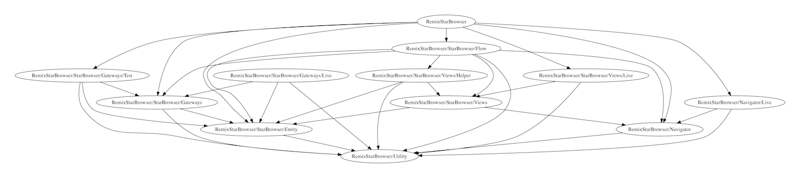

# Muck

Muck analyses dependencies between "components" in your Swift projects.



You can specify what constitutes a "component" using the granularity option. By default this is `module` meaning each Swift module will be considered a separate component. If you only have a single module (as is common), you can change this to `folder`, `file`, or `type` depending on how organised your source code is.

## Running Muck

Muck requires Xcode 26 or a compatible Swift 6 toolchain. It is a Swift Package Manager executable; no generated Xcode project is required.

Build and test it with:

```
swift build
swift test
```

Run the command with `swift run muck --help`, or use the included `Makefile` targets.

## Architecture

Muck is split into targets with dependencies pointing toward the analysis core:

```
MuckApp -> MuckCLI -> MuckSourceKit -> MuckCore
```

`MuckCore` contains the dependency model, cleanliness metrics, transformations, and reports. `MuckSourceKit` adapts Xcode and Swift Package Manager compiler information into declarations. `MuckCLI` parses arguments and coordinates analysis, while `MuckApp` is only the executable entry point.

```
OVERVIEW: A dependency analyser for Swift projects

USAGE: muck <options>

OPTIONS:
  --granularity, -g
                    How to group components [type|file|folder|module] (defaults to module)
  --ignoreExterns, -i
                    Ignore dependencies external to specified modules
  --modules, -m     The modules to analyse (required)
  --package         The Swift package directory
  --project, -p     The Xcode project (specify either package, workspace or project but not more than one)
  --reports, -r     One or more reports to produce on stdout [decl|dep|dotdep|compclean|sysclean] (defaults to all)
  --scheme, -s      The Xcode scheme (required if workspace is specified)
  --target, -t      The Xcode target (permitted if project is specified)
  --verbose, -v     Verbose logging
  --workspace, -w   The Xcode workspace (specify either workspace or project but not both)
  --help            Display available options
```

You need to provide a Swift package directory, or an Xcode workspace/project and scheme, for analysis. You also need to provide the list of Swift modules making up your project. In simple cases where you're building everything into a single app, this will probably just be the name of your app, but in cases where you have divided your code into separate frameworks, you'll need to include the names of those too.

Muck will then build your project and output some reports.

## Common scenarios

**You've got a simple iOS app with all your code organised into folders**

```
muck -p MyApp.xcodeproj -s MyApp -m MyApp -i -g folder
```

**You've got a Swift package**

Muck builds the package with SwiftPM and reads the compiler arguments from its build record:

```
muck --package . --modules Muck MuckApp -i -g module
```

**You have all your code in one folder**

Muck is less useful in this case since it will have to consider each file to be a component which can be a bit noisy:

```
muck -p MyApp.xcodeproj -s MyApp -m MyApp -i -g file
```

**You have a complex project with many separate frameworks**

```
muck -w MyApp.xcworkspace -s MyApp -m MyApp Entity Network Service Utility Wireframe -i -g module
```

**You want to see a visualisation of the dependencies**

Muck can output a Graphviz `dot` format report which you can visualise with `dot`. This requires [Graphviz](http://brewformulas.org/Graphviz) to be installed.

```
muck -p MyApp.xcodeproj -s MyApp -m MyApp -i -g folder -r dotdep | dot -Tpdf -o deps.pdf
```

## Cleanliness

Some of Muck's reports are about "cleanliness" in the sense defined by Uncle Bob in his [Clean Architecture](https://www.amazon.co.uk/Clean-Architecture-Craftsmans-Software-Structure/dp/0134494164) book. You can use Muck to find how far your components deviate from the main sequence.

```
Name,FanIn,FanOut,I,Nc,Na,A,D
"Utility",3,0,0.0000,3,0,0.0000,1.0000
"Entity",5,0,0.0000,7,0,0.0000,1.0000
"Wireframe",9,0,0.0000,11,7,0.6364,0.3636
"Marketplace",0,26,1.0000,57,13,0.2281,0.2281
"Service",4,8,0.6667,4,2,0.5000,0.1667
"GroupSelectionFeature",5,8,0.6154,17,4,0.2353,0.1493
```
